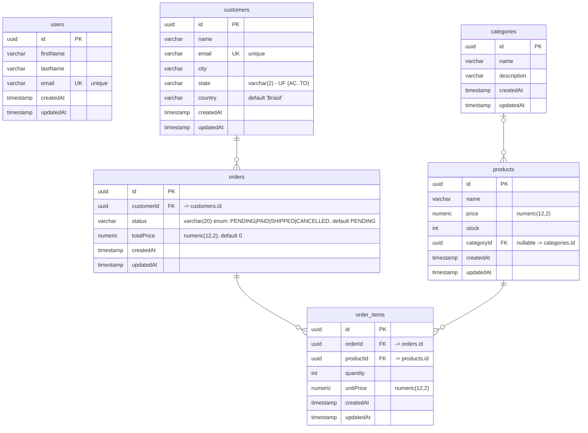
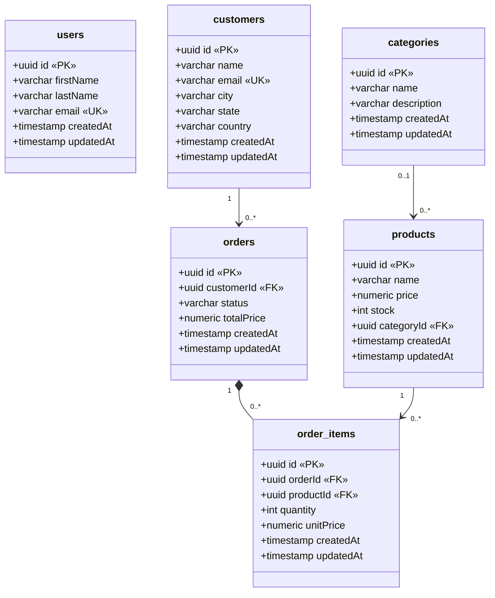

# Modelo de dados (api-nest)

O `api-nest` é o **dono do schema** do banco compartilhado (`postgres-nest`). Com `TYPEORM_SYNC=true`, as entidades TypeORM em [`src/domains/**/entities`](../src/domains) são a fonte da verdade — os diagramas abaixo são gerados a partir delas.

## Diagrama ER (entidade-relacionamento)

## Diagrama UML (diagrama de classes)

Mesma estrutura na notação **UML**: cada tabela é uma classe, atributos no formato `+tipo nome`, com estereótipos `«PK»` / `«FK»` / `«UK»`. As relações usam **multiplicidade** UML e tipo de associação — `orders` → `order_items` é uma **composição** (losango preenchido): um item não existe sem o pedido (delete em cascata).

